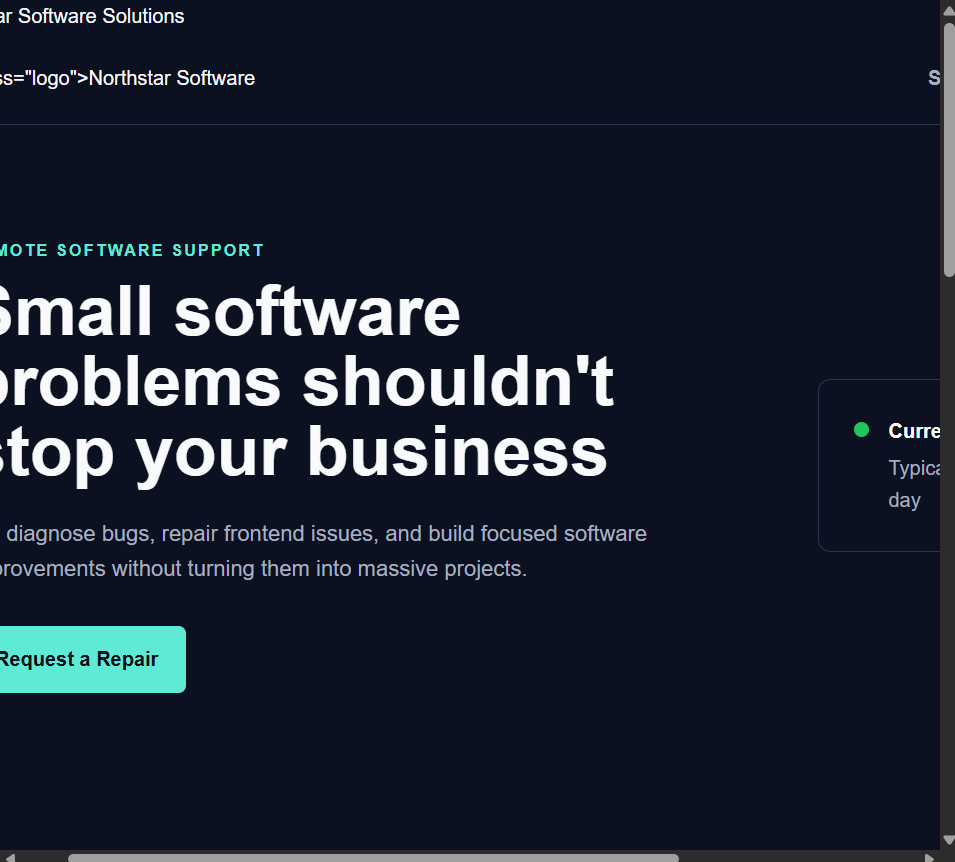
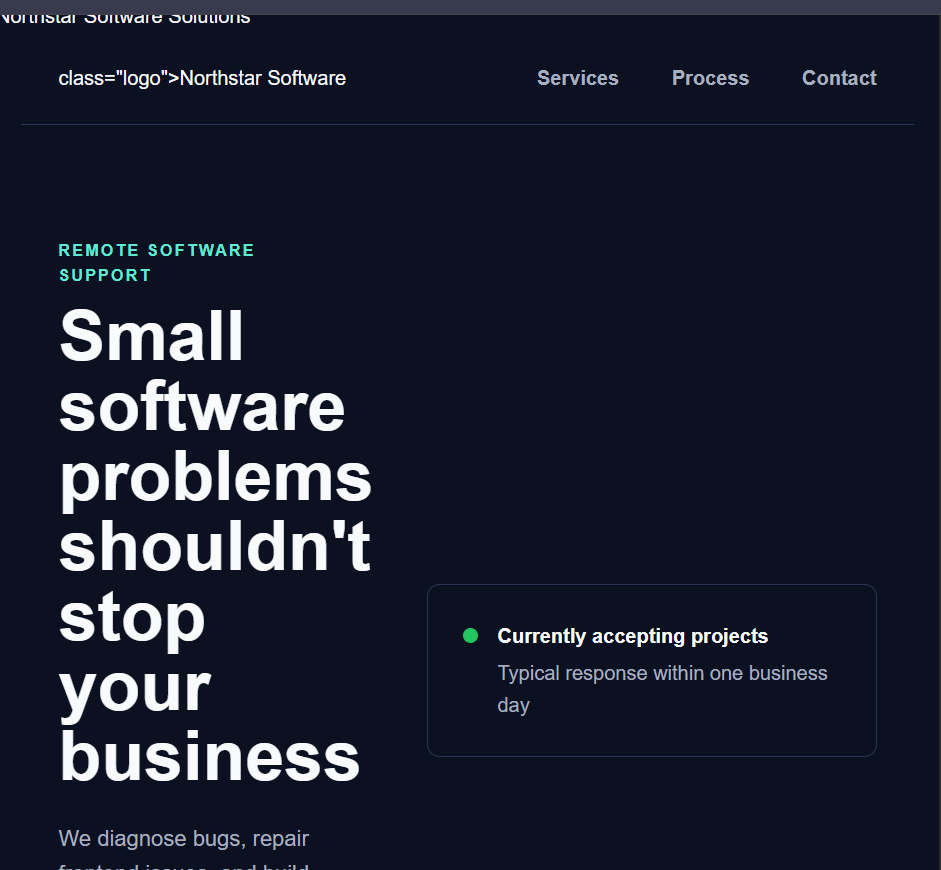

# Frontend Repair Lab

A small frontend debugging project demonstrating how responsive-layout defects and form errors can be diagnosed, repaired, tested, and documented.

The fictional Northstar Software Solutions page was intentionally created with several common frontend problems. The defects were preserved in the Git history before corrective work began.

## Technologies

- HTML5
- CSS3
- JavaScript
- Git
- Responsive web design
- Browser developer tools

## Initial Problems

The original version contained several defects:

- The page enforced a minimum width of 1,100 pixels.
- Major page containers used fixed widths.
- The hero and contact sections used inflexible grid columns.
- Service cards could not stack on smaller screens.
- Form fields could exceed their intended containers.
- The contact form did not validate user input.
- A mistyped HTML element caused a JavaScript runtime error.

## Responsive-Layout Repair

The layout was corrected by:

- Changing the global box model to `border-box`
- Removing the fixed minimum page width
- Replacing fixed container widths with fluid, constrained widths
- Converting the service layout into a responsive CSS Grid
- Using flexible `minmax()` grid columns
- Adding a mobile breakpoint at 760 pixels
- Stacking navigation, service cards, and contact content on narrow screens

### Before



### After



## JavaScript Repair

The contact form now:

- Prevents the default page reload
- Trims submitted values
- Detects incomplete fields
- Validates the email format
- Displays accessible error and success messages
- Clears the form following successful validation

During testing, the browser reported:

```text
TypeError: Cannot read properties of undefined (reading 'trim')